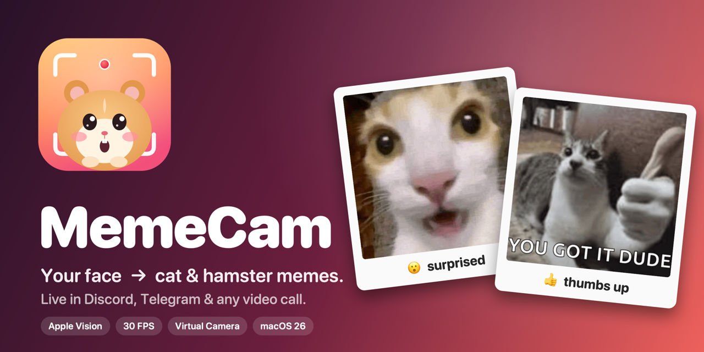

<p align="center"></p>

<p align="center">
  <a href="../../releases/latest"></a>
  
  
  
</p>

**MemeCam** watches your face and hands and instantly shows a matching **cat or hamster meme** next to you —
and sends the result to Discord, Telegram, Zoom or any call as a virtual camera named **MemeCam**.
Native Swift, Apple Vision on the Neural Engine, 30 FPS, no Python, no cloud.

## Highlights

- **19 reactions** — smile, laugh, surprised, eyebrows up, eyes closed, sad, head tilt, 👍 👎 ✌️ ✋ ☝️ ✊ 🙌 🤦 🤔 🫶, and “nobody here”.
- **Learned hand gestures** — a tiny MLP trained on 1.3 M hand-landmark samples from HaGRID v2
  (subject-independent macro-F1 **0.987**), pure-Swift inference in microseconds, with geometric fallback.
- **Personal face model** — expressions are measured relative to *your* neutral face (median auto-calibration),
  corrected for head pose, smoothed with a One Euro filter and debounced by a confidence-weighted vote.
- **Virtual camera** — a CoreMediaIO camera extension fed through a zero-copy IOSurface sink stream.
- **Your memes** — drag any image or GIF onto a reaction to use it; hide built-ins; restore defaults.
- **Accuracy test** — a guided 3-minute session records you and scores the detector per reaction (F1, latency, false switches).
- **Apple-native UI** — Liquid Glass on macOS 26, onboarding, menu bar extra, keyboard shortcuts.

## Install

Download **MemeCam.dmg** from [Releases](../../releases/latest) (signed with Developer ID and notarized),
drag MemeCam to **Applications** (required for the virtual camera) and open it.

**Use it in calls**: click the virtual-camera pill in the toolbar → approve in
*System Settings › General › Login Items & Extensions › Camera Extensions* → restart Discord/Telegram → pick **MemeCam** as camera.

| Shortcut | Action |
|---|---|
| ⌘R | Start / stop camera |
| ⌘K | Calibrate neutral face |
| ⌘1 ⌘2 ⌘3 | Side by side · Picture in picture · Meme only |
| ⌘I | Inspector |
| ⇧⌘E | Customize memes |

## How it works

```
AVCaptureSession (720p, 30 fps, BGRA)
   │                      ┌──────────── Vision (own queue, drops frames while busy) ────────────┐
   ├─► every frame ──────►│ face rectangles rev3 (pose) + landmarks rev3 (76 pts) + hand pose ×2 │
   │                      └───────────────┬──────────────────────────────────────────────────────┘
   │                                      ▼
   │     MemeCamCore:  FaceMetrics (IOD-normalised, de-rotated, yaw/pitch-corrected, AU1/AU4)
   │                   → One Euro filter → scores vs personal baseline (hysteresis)
   │                   HandGestureModel (MLP, HaGRID v2) ⟂ HandShape rules → face-relative rules
   │                   → ReactionStabilizer (weighted vote window, per-reaction enter delay, min hold)
   ▼
Compositor (Core Image on Metal, IOSurface pool, crossfades) ──► preview layer + CMIO sink → MemeCam camera
```

Detection runs on its own queue and never blocks output, so the virtual camera stays at camera rate.
Details and sources: [`docs/research.md`](docs/research.md), [`docs/algorithms-research-2026.md`](docs/algorithms-research-2026.md),
[`docs/virtual-camera.md`](docs/virtual-camera.md).

## Build from source

Requirements: macOS 15+, Apple Silicon, Swift 6 (Command Line Tools are enough — no Xcode needed).

```sh
swift build && swift run MemeCam        # dev run (no virtual camera)
scripts/test.sh                         # unit tests (Swift Testing)
scripts/build-app.sh --install --run    # build/MemeCam.app → /Applications
```

### Signing (virtual camera)

The camera extension needs the System Extension capability (paid Apple Developer Program).
`scripts/setup-signing.py` provisions everything through the App Store Connect API — device, bundle IDs,
certificate, profiles — into `~/.memecam-signing/` (never into the repo):

```sh
uv run --script scripts/setup-signing.py                    # Apple Development (this Mac)
uv run --script scripts/setup-signing.py --distribution     # Developer ID (Account Holder CSR flow)
scripts/build-app.sh --release                              # notarized + stapled build/MemeCam.dmg
```

### Tuning the detector

```sh
# In the app: Inspector › Accuracy › Run Accuracy Test… (recordings in ~/Library/Application Support/MemeCam/Recordings)
swift run -c release memecam-eval <recording.json>   # per-reaction feature distributions + report
```

Drop recordings into `Tests/Fixtures/` (git-ignored) and `scripts/test.sh` enforces a quality bar on them.
Gesture model training: [`Tools/gesture-training/`](Tools/gesture-training/README.md).

## Project layout

| Path | What |
|---|---|
| `Sources/MemeCamCore` | Pure, tested logic: metrics, classifier, stabilizer, gesture MLP, evaluator, guided session |
| `Sources/MemeCam` | App: capture, Vision, compositor, virtual-camera client, SwiftUI UI |
| `CameraExtension/` | CoreMediaIO camera extension (built by `build-app.sh`) |
| `Resources/Memes` | Bundled memes + `memes.json` manifest |
| `Resources/Models` | Hand-gesture MLP weights + golden vectors |
| `Tools/` | `memecam-eval`, gesture training pipeline |
| `scripts/` | build, sign, test, icon/cover rendering |

## Troubleshooting

- **MemeCam camera missing in Discord/Telegram** — restart them after approving (they cache the device list);
  check `systemextensionsctl list` shows `com.hexarch.memecam.camera-extension [activated enabled]`.
- **“Must run from /Applications”** — move the app there and open that copy.
- **iPhone / Continuity camera is black** — keep the iPhone locked, nearby, in landscape; or pick another camera in the toolbar.
- **Too sensitive / too slow** — Inspector › Detection sliders; ⌘K to recalibrate.
- Logs: `log stream --predicate 'subsystem == "com.apple.cmio"'`.

## Credits & licensing

Private project, all rights reserved. Third-party material — memes from Tenor (© their owners), the HaGRID v2
dataset licence (non-commercial) and others — is listed in [`THIRD_PARTY_NOTICES.md`](THIRD_PARTY_NOTICES.md).
